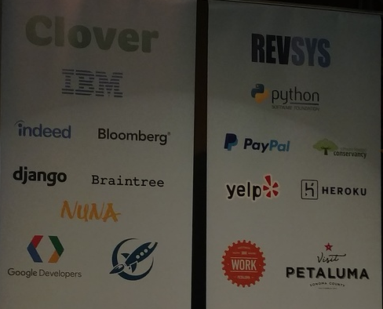
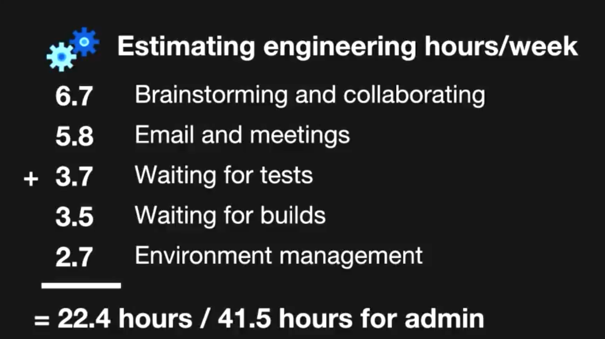
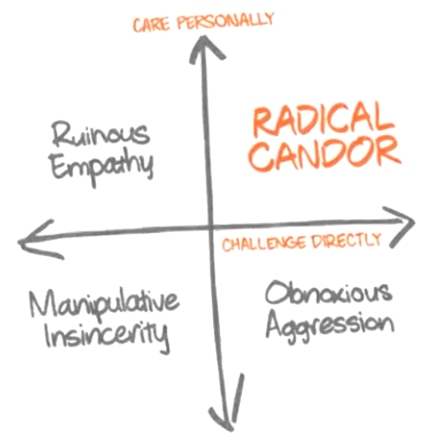
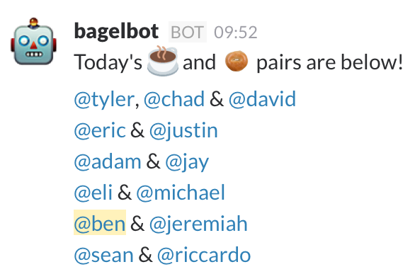

class: middle

# North Bay Python
#### Conference recap

Gabriel Knoy

gknoy@ciena.com

2017-12-08

---

## North Bay Python Conference

- Dec. 2 - 3
- Single track
- ~300 attendees
- Not all things were immediately useful to us
- [Youtube videos of most talks](https://www.youtube.com/channel/UCLc1vUexbRTlRBJcUG9U6ug/videos)

---
## Sponsors



---

## Useful Things

- `mypy`: Enforce type annotations
- `PEP 551`: Security auditing hooks (Steve Dower)
- Leadership skills for Engineers (Kathleen Vignos)
- Python + C/Fortran (Catherine Maroney, Zach Voase)
- Search-first Writing (Heidi Waterhouse)
- Async (Henry Chen)
- Accessibility (Lindsey Dragun)
- Including "Quiet" Developers

---

## Interesting things

- Keynote: Slide presentations with python (Brandon Rhodes)
- Keynote: "2FA Mind" (Carina C. Zona)
- Building a healty testing culture (Julia Duimovich)
- Raft algorithm: Distributed consensus (Laura Hampton)
- Twitter bots: random walks and Markov chains
- SMS Adventure game, Fortran IV interpreter (Chris Swanson)
- Machine Learning (George Brocklehurst)
- Iteration: Iterables, Iterators ...
---

## [`mypy`](http://mypy-lang.org/): Enforce type annotations
_Henry Tanner_

```python
def foo(n: int) -> str:  # not enforced
  return 'wat'
```

```sh
pip install mypy
```

```sh
# in CI/tests:
mypy <module> \
  --ignore-missing-imports \ # remove after 3party things typed
  --strict-options \  # check optional params too
  --disallow-untyped-defs \  # endgame ;)
```
---
## `mypy` (continued)

- Must sometimes generate hooks with `stubgen`
- Does not easily let you annotate a dict where values can be different types:

```python
movie = {'name': 'Blade Runner', 'year': 1982}
```
```python
from mypy_extensions import TypedDict

Movie = TypedDict('Movie', {'name': str, 'year': int})
# or
class Movie(TypedDict):
    name: str
    year: int

movie = {'name': 'Blade Runner', 'year': 1982}  # type: Movie

```
---

## [PEP 551](https://www.python.org/dev/peps/pep-0551/): Security auditing hooks
_Steve Dower_

[Video](https://www.youtube.com/watch?v=K7qUVyeh10U)

[cypython fork](https://github.com/zooba/cpython/tree/pep551)

- Assume that you've been breached
- malware uses `exec(eval(...`, `b64decode(...`
- Add auditing hooks to your runtime to detect `exec()` or other decoded attacks
- Python has to get it in plaintext to execute it, so that means we can log it
- Can prevent loading of things like gists or link-shorteners
- Must actually read the logs

```python
# in app init
sys.addaudithook(prevent_bitly)  # etc
```
---
#### OK
- socket
- urllib

#### Sketchy
- exec
- eval
- ctypes

#### Nope, Nope, Nope ...
- Unpickler.findclass
- reading from gist, url shorteners
- compile/exec arbitrary strings
- shenanigans with class loaders
- sys._getframe()
- sys._current_frames()

---

## Python Bindings for CFFI, Fortran

Two talks on running things in C/Fortran that are slow for Python

#### CFFI binding (Zach Voase)
[Video](https://www.youtube.com/watch?v=Ng0_cuaHgMU)

#### Python + (Fortran and C) in large-scale number crunching and scientific programming (Catherine Moroney, JPL)
[Video](https://www.youtube.com/watch?v=92EYpOPGIFY)

---

## Python + Fortran/C

- `numpy` data structs are much easier to declare than in C
- String processing much eaier in Python
- Do fast things in C/Fortran (e.g. deep loops)
- Can use Python to unit test C libraries
- Use Python for everything you can
- Build/test interface between Python and the library _before_ worrying about what the library does

---

## Leadership skills for Engineers
_Kathleen Vignos_

[Video](https://www.youtube.com/watch?v=zcO-U1leTho)

- Communicate Clearly
- Time Management
- Share candid feedback
- Build trust
- Active Listening
- Increase technical competence

---
##### Communicate Clearly
- in email, tech docs
- be concise, always have a call to action
- "Customer service" tone: polite, patient, kind

##### Time Management
- how/when to say No
- when to say yes
- learn to estimate
- double estimates because we have lots of time spent not-coding


---

##### Share candid feedback
- "Why didn't you tell me?": not just manager's job
- Give people a change to get better
- Care deeply
- Challenge directly
- Talk about Situation, Behavior, Impact
- "Radical candor"


---

##### Build trust
- teach, listen, coach, give credit to others
- solicit ideas

##### Active Listening
- 1:1 meetings (not just mgmt)
- Coffee-bot :)
- eye contact
- no distractions (phone/notes)
- ask questions
- parapharase _what you think they meant_

##### Increase technical competence
- pair program
- use and learn from design patterns, frameworks, first principles
- get to _why_ we are doing this (5 whys)
---
## Seriously, Coffee-bot
- Opt-in Slack bot that pairs people for 1:1 lunch/coffee/walk meetings
- Learn a deeper slice about others' jobs / personality

#### e.g. [https://github.com/statmuse/bagelbot](https://github.com/statmuse/bagelbot)


---

## Search-first Writing
_Heidi Waterhouse_

- Users are already angry when they get there
- Your FAQs ... aren't

#### Get real Questions
- What questions do people actually ask?
  - Find out the search terms they use (e.g. "BSOD")
- Find people like your users
- What are users trying to _accomplish_?
- Talk to tech support

#### Answers
- Get a giant stack of questions, pick 20 of these
- Write **exact answers** for these questions
- Add analytics to see what people search for, which answers help
---
## How to answer

#### Establish where we are
- prerequisites, what this page is about, what this doc explains

#### Why am I here?
- tell them where the cheese is

#### Give Orders
- strip politeness
- Do This. Then do this.
- Never use "if/then/else"

#### Write a unit test
- "You can now .... ", or "You now can see ..."
---
## `async` for Python
_Henry Chen_

```python
import asyncio
```
- code as if single threaded
- makes asynchronous code much easier to read
- `@asyncio.coroutine` and other annotations
- `asyncio.get_event_loop()` if you don't want to make your own

- **DO NOT** read the docs
- **DO** watch David Beazley's youtube channel
- **DO** read Brett Cannon's blog pos

---

## Accessibility Matters
_Lindsey Dragun_

Slides at [http://dragun.tech/nbpy/](http://dragun.tech/nbpy/)

How others perceive / understand / navigate / contribute on your site

Disability can be:
- permanent: usu have a way to use other devices
- temporary (sick, injured)
- acquired (aging)
- left-handed

"Stress" cases, not "edge" cases
---
## Accessibility concerns
Users are often more than one of:
- Visual
- Auditory
- Motor/Physical
- Cognitive/Neurological
- Language/Speech
---

## Including "Quiet" develpers
_Seán Hanson_

Not all devs are visible outside work
- may have a job that is non-public
- fear harassment or feel unsafe (women, POC, LGBT)
- child or family care
- have other hobbies
- religion
- multiple jobs
- location

OSS presence is often used as a proxy that filters for things that are illegal to ask about:
- age, lang, sex, religion, clubs, drug recovery, etc

---
## Empowering Quiet devs

Conferences:
- don't require participation in specific communities/activities
- make safe spaces (e.g. Women, AA, etc)
- demand a comprehensive code of conduct from the events you attend

Open source:
- don't require contribution in public
- curate your org's own repos/organizations so that they have a safe space
- label and preserve things that can be done/fixed by junior devs or people who are new
- thank contributors, even if closing the issue

---
## Colossal cave adventure

_Chris Swenson_

#### `669-238-3683`
- Twilio (SMS) game
- Fortran IV (PDP-10) interpreter in python
---
## Not covered ...

Several other talks, some of which include:

- Keynote: Slide presentations with python (Brandon Rhodes)
- Keynote: "2FA Mind" (Carina C. Zona)
- Building a healty testing culture (Julia Duimovich)
- Raft algorithm: Distributed consensus (Laura Hampton)
- Twitter bots: random walks and Markov chains
- Machine Learning (George Brocklehurst)
- Iteration: Iterables, Iterators ...